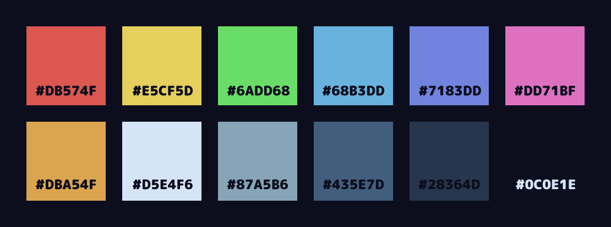

  
  <h2 align="center">Cabin - a dark and cozy nvim theme. 🏠🌲</h2>

## The whys and whats ✨

I've relapsed into the dark and dangerous world of unix ricing. And of course, everything needs to be match matchy and looking good. Therefore I'm taking my nvim theme *Cabin* and throwing that magnificent creation onto the world.

## Palette please 💅

Here you go. Hand picked and superior to all other color palettes. Except maybe [Magoon](https://github.com/ntwigs/magoon), since that theme is just.. wow! But Cabin is at least a good old 8/10. 😬

## Code examples please 🙏

TBA

  

 
  The was built with black metal 🎸, and and just a bit of spare time.  
  

